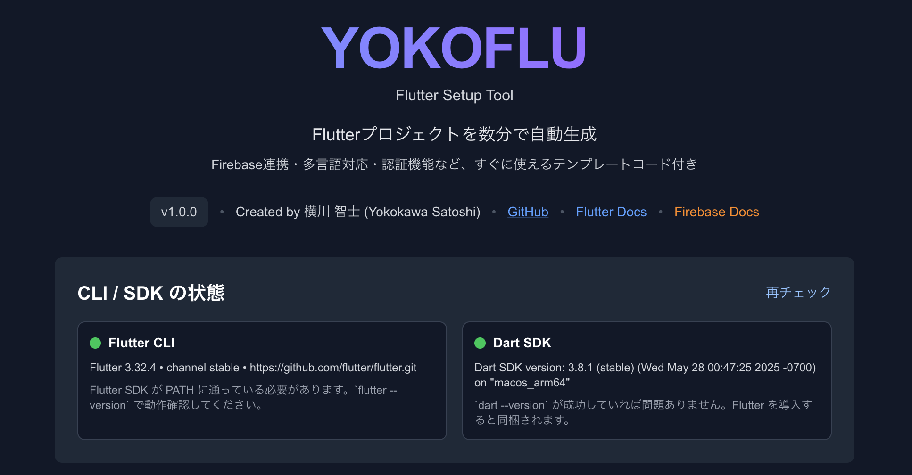
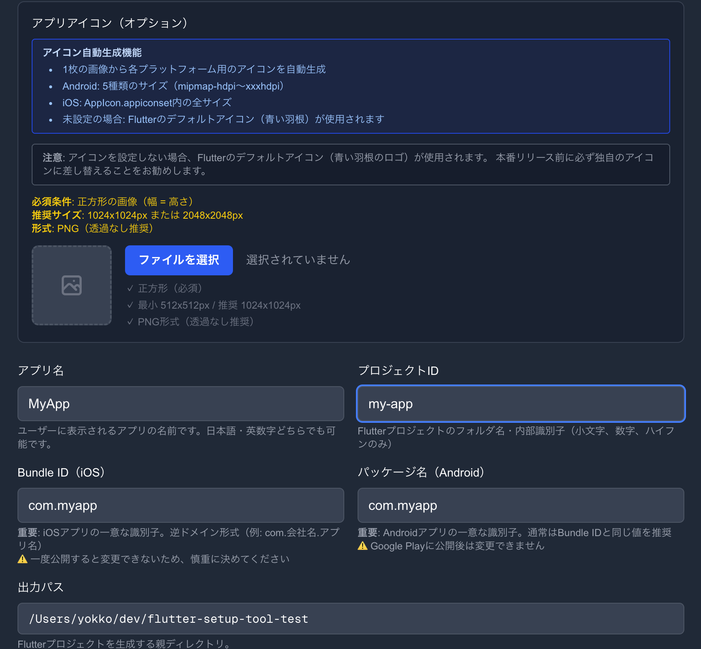
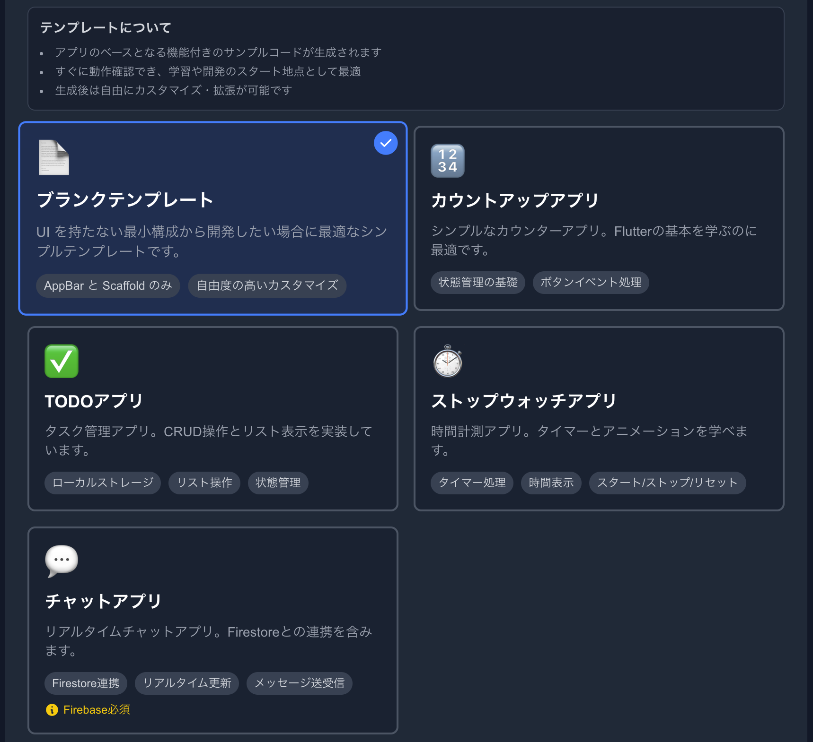
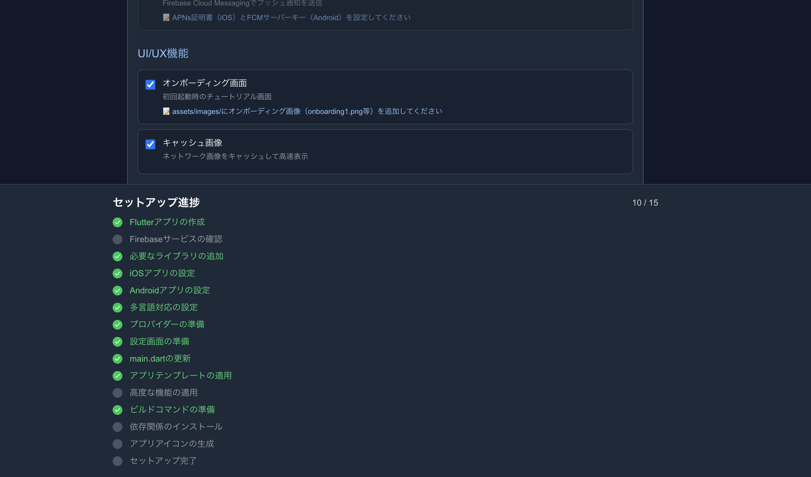
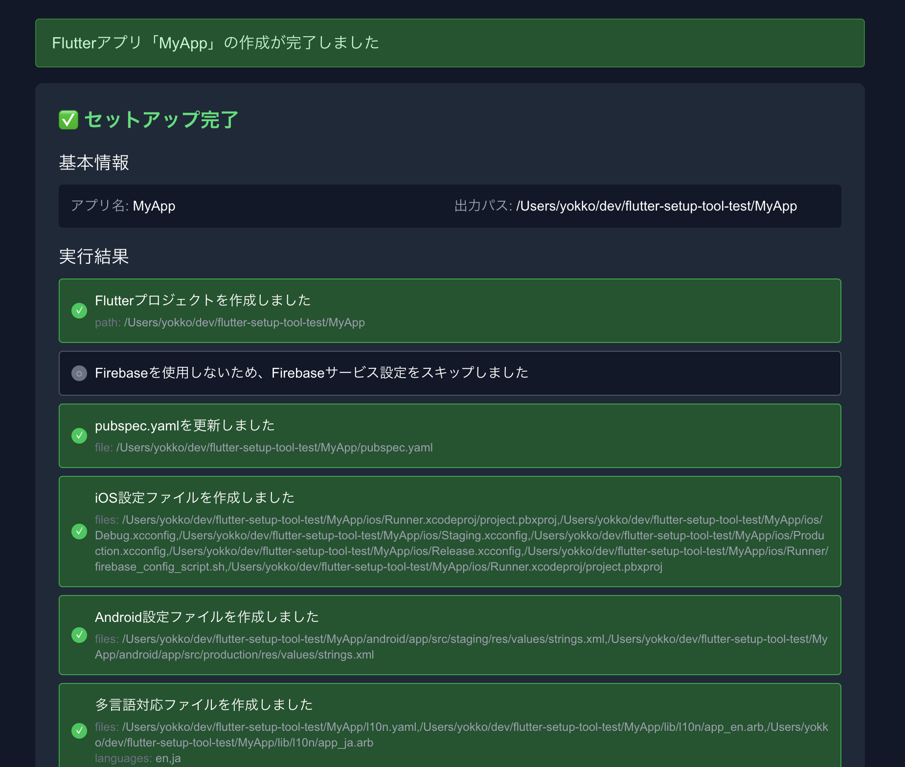

# YOKOFLU (Flutter Setup Tool)

**Flutter アプリの開発を爆速で始められる、包括的なプロジェクトセットアップツール**

GUI で必要な設定を選択するだけで、実務レベルの Flutter プロジェクトが数分で完成します。Firebase 連携、多言語対応、テーマ切り替え、認証機能など、よく使う機能のテンプレートコードを自動生成します。

[](https://opensource.org/licenses/MIT)
[](https://github.com/yokkomystery/YokoFlu/actions/workflows/ci.yml)
[](https://github.com/yokkomystery/YokoFlu/releases)
[](https://github.com/yokkomystery/YokoFlu/issues)
[](https://nextjs.org/)
[](https://flutter.dev/)

> 🌐 **English**: See [README.md](README.md)

> 💡 **これはローカル実行専用のツールです。**
> Web ホスティングではなく、あなたのマシンで `npm run dev` して使用します。

> 🚀 **Quick Start**:
>
> ```bash
> git clone https://github.com/yokkomystery/yokoflu.git
> cd yokoflu
> npm install
> npm run dev
> # ブラウザで http://localhost:3000 を開く
> ```

---

## 主な機能

### アプリテンプレート（5 種類）

- **ブランク**: 最小構成で自由に開発
- **カウンター**: Flutter の基本を学ぶ
- **TODO**: CRUD 操作とローカルストレージ
- **ストップウォッチ**: タイマー処理
- **チャット**: Firestore を使用したリアルタイムチャット

### 高度な機能（11 種類をオプション選択）

**アプリ管理**: 強制アップデート、メンテナンスモード、アプリ評価  
**認証**: Firebase 匿名認証、Google サインイン、Apple サインイン  
**分析・監視**: Firebase Analytics、Crashlytics、プッシュ通知  
**UI/UX**: オンボーディング画面

### 自動化機能

- Flutter プロジェクトの自動作成
- Firebase 環境分離設定（Staging/Production）
- iOS/Android 設定ファイルの自動生成
- 多言語対応（ARB ファイル自動生成）
- テーマ切り替え機能
- 設定画面テンプレート
- アプリアイコンの自動生成
- クリーンアーキテクチャ

> **メモ:** Firebase コンソール側でのサービス有効化やルール設定は自動化されません。生成後に表示される手順に従って手動で設定してください。

## 前提条件

### 対応プラットフォーム

| プラットフォーム | Android 開発  | iOS 開発    |
| ---------------- | ------------- | ----------- |
| **macOS**        | ✅ 完全対応   | ✅ 完全対応 |
| **Windows**      | ✅ 完全対応   | ❌ 非対応\* |
| **Linux**        | ⚠️ 未検証\*\* | ❌ 非対応\* |

\* iOS 開発には Xcode が必要で、macOS でのみ利用可能です。  
\*\* Linux でも Android 開発は動作すると思われますが、未検証です。

### 必要なソフトウェア

- Node.js 18 以上
- Flutter SDK 3.x / Dart SDK 3.x
- Firebase CLI 13+（`npm install -g firebase-tools`）
- flutterfire CLI（`dart pub global activate flutterfire_cli`）
- Firebase CLI で `firebase login` 済み

確認コマンド:

```bash
flutter --version
dart --version
flutterfire --version
firebase --version && firebase projects:list
```

## インストール & 起動

### 前提条件

このツールを使用するには、**あなたのマシンに以下がインストールされている必要があります**：

- Node.js 18 以上
- Flutter SDK 3.x / Dart SDK 3.x
- Firebase CLI 13+（`npm install -g firebase-tools`）
- flutterfire CLI（`dart pub global activate flutterfire_cli`）

### セットアップ

```bash
# リポジトリをクローン
git clone https://github.com/yokkomystery/yokoflu.git
cd yokoflu

# 依存関係をインストール
npm install

# 開発サーバーを起動
npm run dev
```

**ブラウザで http://localhost:3000 を開きます**

### なぜローカル実行が必要？

このツールはあなたのマシンで **Flutter CLI を実行** し、**ローカルのファイルシステムにプロジェクトを生成** します。

- Web ホスティングでは、サーバー側で実行されるためユーザーが生成ファイルにアクセスできません
- ローカル実行により、生成されたプロジェクトに直接アクセス・編集できます
- より安全で、自分の開発環境で完結します

## 使い方の流れ

### Step 1: CLI/SDK の確認



画面を開くと、上部に CLI/SDK の状態が表示されます。

- Flutter CLI: インストールされているか確認
- Dart SDK: インストールされているか確認
- flutterfire CLI: インストールされているか確認
- Firebase CLI: インストールされているか、ログイン済みか確認

ステータスが「未検出」の場合は、インストールコマンドと公式ドキュメントのリンクが表示されます。Firebase を利用する場合は `firebase login` → `firebase projects:list` で認証済みか確認してください。

### Step 2: 基本情報の入力



次に基本情報を入力します。

**必須項目:**

- **アプリ名**: ユーザーに表示されるアプリの名前（例: MyAwesomeApp）
- **プロジェクト ID**: Flutter プロジェクトのフォルダ名（例: my-awesome-app）
- **Bundle ID（iOS）**: iOS アプリの一意な識別子（例: com.company.myapp）
- **パッケージ名（Android）**: Android アプリの一意な識別子（例: com.company.myapp）
- **出力パス**: Flutter プロジェクトを生成する親ディレクトリ（例: /Users/yourname/projects）

**注意点:**

- Bundle ID とパッケージ名は一度公開すると変更できないため、慎重に入力してください
- 実際のプロジェクトは「出力パス/アプリ名」に作成されます

**オプション:**

- **アプリアイコン**: 正方形の画像（推奨: 1024x1024px）をアップロードすると、各プラットフォーム用のアイコンを自動生成します

### Step 3: アプリテンプレートの選択



使用したいアプリテンプレートを選択します。

- **ブランクテンプレート**: UI 要素を持たない最小構成
- **カウントアップアプリ**: Flutter の基本を学べるカウンター
- **TODO アプリ**: CRUD 操作とローカルストレージを使用
- **ストップウォッチアプリ**: タイマー処理とラップタイム機能
- **チャットアプリ**: Firestore を使用したリアルタイムチャット（Firebase 必須）

### Step 4: Firebase 設定

Firebase を利用する場合は、以下の設定を行います。

**Firebase を利用する**: チェックボックスをオンにします

Firebase の機能:

- **Authentication**: ログイン・ユーザー管理
- **Firestore**: データベース
- **Storage**: 画像・ファイル保存
- **Analytics**: ユーザー行動分析
- **Remote Config**: アプリの動的設定変更

**環境分離（推奨）**:
開発用（Staging）と本番用（Production）で Firebase プロジェクトを分けることを推奨します。

- 「ステージングとプロダクション環境を分離する」にチェック
- ステージング環境の Firebase プロジェクト ID を入力（一覧から選択可）
- プロダクション環境の Firebase プロジェクト ID を入力（一覧から選択可）

### Step 5: 基本機能の選択

**設定画面テンプレート**:
テーマ切り替え（ライト/ダーク/システム）、言語選択、アプリ情報、利用規約リンクなどを含む設定画面を自動生成します。

**多言語対応（i18n）**:
対応したい言語を選択します。最低でも英語または日本語のどちらか一方は必ず選択してください。

- 英語（en）: デフォルト言語
- 日本語（ja）: 日本語 UI 文言

### Step 6: 高度な機能の選択（オプション）

必要に応じて、以下の機能を選択できます。

**アプリ管理**: 強制アップデート、推奨アップデート、メンテナンスモード、アプリ評価機能  
**認証機能**: Firebase 匿名認証、Google サインイン、Apple サインイン  
**分析・監視**: Firebase Analytics、Crashlytics、プッシュ通知  
**UI/UX**: オンボーディング画面

### Step 7: プロジェクト作成



「Flutter アプリを作成」ボタンをクリックすると、セットアップが開始されます。

画面下部に進捗バーが表示され、以下のステップの進行状況が確認できます：

1. Flutter アプリの作成
2. Firebase サービスの確認（Firebase 利用時）
3. 必要なライブラリの追加
4. iOS アプリの設定
5. Android アプリの設定
6. 多言語対応の設定
7. プロバイダーの準備
8. 設定画面の準備
9. main.dart の更新
10. アプリテンプレートの適用
11. 高度な機能の適用（選択時）
12. ビルドコマンドの準備
13. 依存関係のインストール
14. アプリアイコンの生成（画像をアップロードした場合）
15. セットアップ完了

各ステップはリアルタイムで更新され、エラーが発生した場合は赤色で表示されます。

### Step 8: セットアップ完了



セットアップが完了すると、進捗バーに「セットアップ完了！」と表示され、「閉じる」ボタンが表示されます。

「閉じる」ボタンをクリックすると、以下の情報が表示されます：

**生成されたファイル一覧**: 作成されたファイルのパスが表示されます

**次のステップ**: アプリを実行する方法やビルドコマンドが表示されます

Firebase を利用した場合は、Firebase コンソールで以下を設定してください：

1. Firebase サービスを有効化（Firestore、Storage、Analytics など）
2. Firestore のセキュリティルールを設定
3. Storage のセキュリティルールを設定
4. Firebase 設定ファイル（google-services.json / GoogleService-Info.plist）を取得してプロジェクトに配置

## 生成されるファイル

- `lib/firebase_options_staging.dart` / `lib/firebase_options_production.dart`
- `lib/firebase_config.dart`
- `ios/*.xcconfig`、`ios/Runner/firebase_config_script.sh`
- `android/app/build.gradle(kts)`（flavor 追加）
- `README.md`（ビルド方法・Firebase 手順を追記）

## ビルドコマンド

### Android

```bash
# Staging環境（開発）
flutter run --flavor staging --dart-define=ENVIRONMENT=staging

# Staging環境 - APK（テスト配布用）
flutter build apk --flavor staging --dart-define=ENVIRONMENT=staging --release

# Staging環境 - AAB（Google Play用）
flutter build appbundle --flavor staging --dart-define=ENVIRONMENT=staging --release

# Production環境（開発）
flutter run --flavor production --dart-define=ENVIRONMENT=production

# Production環境 - APK（テスト配布用）
flutter build apk --flavor production --dart-define=ENVIRONMENT=production --release

# Production環境 - AAB（Google Play用）
flutter build appbundle --flavor production --dart-define=ENVIRONMENT=production --release
```

### iOS

```bash
# Staging環境（開発）
flutter run --flavor staging --dart-define=ENVIRONMENT=staging

# Staging環境 - iOSビルド
flutter build ios --flavor staging --dart-define=ENVIRONMENT=staging --release

# Staging環境 - IPAファイル
flutter build ipa --flavor staging --dart-define=ENVIRONMENT=staging --release

# Production環境（開発）
flutter run --flavor production --dart-define=ENVIRONMENT=production

# Production環境 - iOSビルド
flutter build ios --flavor production --dart-define=ENVIRONMENT=production --release

# Production環境 - IPAファイル
flutter build ipa --flavor production --dart-define=ENVIRONMENT=production --release
```

> **注意**: iOS は本ツールが作成する Xcode の Scheme（`staging`/`production`）を使います。`--flavor` で Scheme を選択してください。Xcode でビルドする場合も同名の Scheme を選択します。  
> **IPA ファイル**: `flutter build ipa`は自動的にアーカイブとエクスポートを行い、`build/ios/ipa/`に IPA ファイルを生成します。

## トラブルシューティング

### 一般的な問題

**Firebase CLI が未検出**: `npm install -g firebase-tools` 実行後、`firebase --version` が成功することを確認。必要に応じて `PATH` に `$(npm bin -g)` を追加。

**Flutter CLI が未検出**: https://docs.flutter.dev/get-started/install を参照して SDK を導入し、`flutter --version` が実行できるようにする。

**flutterfire CLI が未検出**: `dart pub global activate flutterfire_cli` を実行し、`~/.pub-cache/bin` などを `PATH` に追加。

**ログイン状態が未確認**: `firebase login` を実行し、続けて `firebase projects:list` でプロジェクト一覧が表示されるかを確認。

**CLI が実行できない**: 実行ユーザーの権限やシェル環境（zsh/bash）の初期化スクリプトを見直す。

**`flutter pub get` が失敗する**: `flutter pub get` を直接実行し、依存関係やネットワーク設定、`pubspec.yaml` の記述に問題がないか確認。

### Windows 固有の問題

**PATH が認識されない**: Flutter/Firebase CLI をインストール後、ターミナルを再起動するか、`refreshenv` を実行（Chocolatey を使用している場合）

**PowerShell 実行ポリシーエラー**: PowerShell を管理者として実行し、以下を実行：

```powershell
Set-ExecutionPolicy -ExecutionPolicy RemoteSigned -Scope CurrentUser
```

**Windows でコマンドが見つからない**: PATH 環境変数に以下が含まれているか確認：

- `%LOCALAPPDATA%\Pub\Cache\bin`（Dart グローバルパッケージ用）
- Flutter SDK の `bin` ディレクトリ
- Node.js インストールディレクトリ

**Git Bash での問題**: Flutter CLI との互換性を高めるため、PowerShell または コマンドプロンプトを使用

### macOS 固有の問題

**Xcode Command Line Tools**: Xcode Command Line Tools がインストールされていることを確認：

```bash
xcode-select --install
```

**CocoaPods の問題**: iOS ビルドエラーが発生した場合は CocoaPods を更新：

```bash
sudo gem install cocoapods
```

### Linux 固有の問題

**Snap でインストールした Flutter**: snap 経由で Flutter をインストールした場合、手動で PATH を設定する必要がある場合があります

**権限の問題**: グローバルパッケージのインストール時に、ファイル権限の調整や `sudo` の使用が必要な場合があります

## Author

**Satoshi Yokokawa（横川 智士）**

- Email: contact@mysterylog.com
- GitHub: [@yokkomystery](https://github.com/yokkomystery)

## ライセンス

MIT License - 詳細は [LICENSE](LICENSE) ファイルをご覧ください。

Copyright (c) 2025 Satoshi Yokokawa（横川 智士）

## 利用規約

本ツールを使用する前に[利用規約](TERMS_OF_USE_ja.md)をご確認ください。主なポイント：

- ✅ **生成されたコードは 100%あなたのもの** - 自由に使用可能
- ✅ **クレジット表記は不要** - していただけると嬉しいですが義務ではありません
- ✅ **商用利用は完全に許可** - 手数料やロイヤリティは不要
- ❌ **保証は提供されません** - 自己責任でご使用ください
- ⚠️ **サードパーティの規約遵守** - Firebase 等の規約はあなたの責任です

## お問い合わせ

- Email: contact@mysterylog.com
- 問題報告: [GitHub Issues](https://github.com/yokkomystery/yokoflu/issues)

---

**Made with ❤️ for Flutter Developers**
